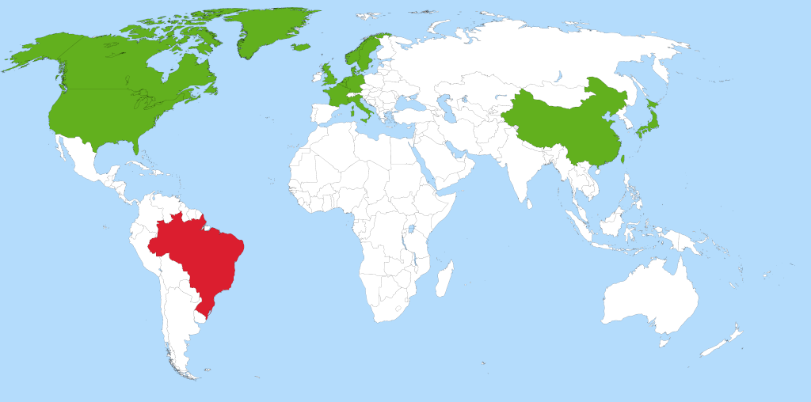

---
# A Demo section created with the Blank widget.
# Any elements can be added in the body: https://wowchemy.com/docs/writing-markdown-latex/
# Add more sections by duplicating this file and customizing to your requirements.

weight: 10 # Order that this section will appear.
design:
  # Choose how many columns the section has. Valid values: 1 or 2.
  columns: '2'
  # Add custom styles
  css_style:
  css_class:
---

 

<b>CIn-TRUST</b> is a research group located in Brazil with national and international collaborations, both in academia and industry. The following map highlights our past and current collaborations around the world.

 

<b>Countries</b>: 
Belgium,
Canada,
China,
Denmark,
France,
Germany,
Italy,
Japan,
Luxembourg,
Netherlands,
Norway,
Singapore,
Sweden,
United Kingdom,
United States of America.

 

	

 

If you want to collaborate, please do not hesitate to contact us.

